# cobaltstrike4.5_cdf
**cobaltstrike4.5版本破解、去除checksum8特征、bypass BeaconEye、修复错误路径泄漏stage、增加totp双因子验证、增加用户名加密显示、修复4.5版本foreign派生错误的bug、客户端配置文件名字修改等**

cobalt strike4.5破解

cobaltstrike4.5破解

[TOC]

# 免责声明\免责协议

**此工具以及文章内容仅限于安全研究，用户承担因使用此工具以及文章内容而导致的所有法律和相关责任！作者不承担任何法律责任! 如您在使用本工具以及文章内容的过程中存在任何非法行为，您需自行承担相应后果，我们将不承担任何法律及连带责任，否则，请您不要安装并使用本工具。您的使用行为或者您以其他任何明示或者默示方式表示接受本协议的，即视为您已阅读并同意本协议的约束。在使用本工具进行安全研究时，您应确保该行为符合法律法规，并且已经取得了足够的授权。请勿对非授权目标使用。**


是的，我又回来了，继续原cobaltstrike4.4_cdf：https://github.com/lovechoudoufu/about_cobaltstrike4.4_cdf 这次是4.5版本。之前的4.4被github给删了，估计过不了多久该项目也会被删除～。

**建议加入小飞机群，后续其他更新及项目被删除后可从群内下载：**


使用前请认真核对相应版本jar包hash。

# cs破解

## 4.5之前版本

**证书认证流程(4.3为例)**：4.5版本最后稍有改动。

各个版本的官方解密key：

```
4.0 1be5be52c6255c33558e8a1cb667cb06
4.1 80e32a742060b884419ba0c171c9aa76
4.2 b20d487addd4713418f2d5a3ae02a7a0
4.3 3a4425490f389aeec312bdd758ad2b99
4.4 5e98194a01c6b48fa582a6a9fcbb92d6
```

**cobaltstrike.auth**认证密钥文件，rsa加密，解密内容：

4.3
```
-54, -2, -64, -45,	//文件头
0, 77,	//后续长度 
1, -55, -61, 127, 	//证书时间限制29999999（永久）
0, 0, 0, 1, 	//watermark（水印）
43, 	//版本
16, 20, 20, 20, 20, 20, 20, 20, 20, 20, 20, 20, 20, 20, 20, 20, 20, 
16, 20, 20, 20, 20, 20, 20, 20, 20, 20, 20, 20, 20, 20, 20, 20, 20, 
16, 20, 20, 20, 20, 20, 20, 20, 20, 20, 20, 20, 20, 20, 20, 20, 20, 
16, 58, 68, 37, 73, 15, 56, -102, -18, -61, 18, -67, -41, 88, -83, 43, -103

```

每更新一个版本，对应的长度+17，key增加17位。

aggressor/Aggressor.class中`License.checkLicenseGUI(new Authorization());`开始license认证：

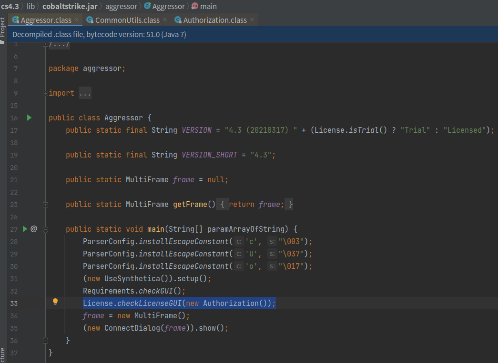

`License.checkLicenseGUI`中`isValid`、`isPerpetual`、`isExpired`、`isAlmostExpired`对授权是否有效、授权是否过期进行判断：

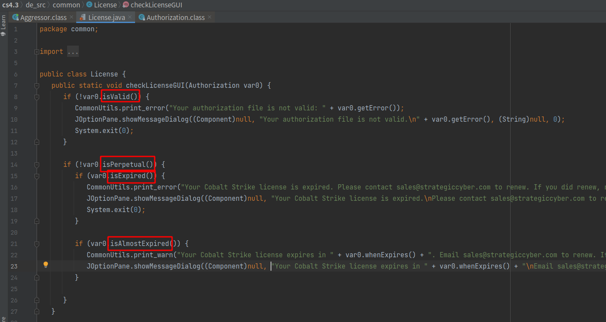

`Authorization`类中是cobaltstrike.auth文件的处理，读取文件内容，调用`AuthCrypto().decrypt`对内容进行处理：

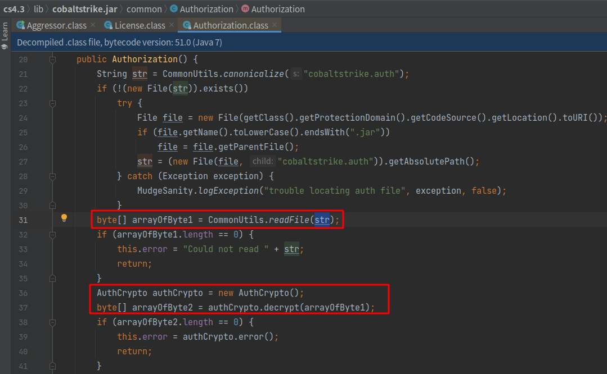

`AuthCrypto（）`中构造函数中调用`load()`，load()函数中对resources/authkey.pub进行md5判断，再获取了RSA的公钥：

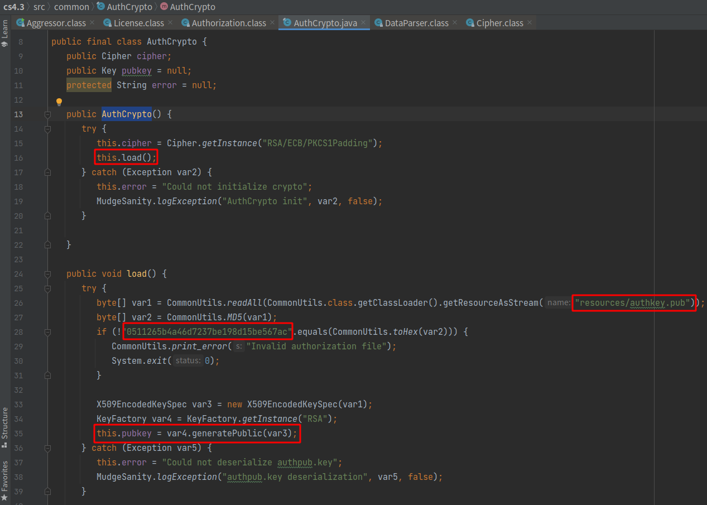

decrypt()中调用_decrypt对cobaltstrike.auth文件内容用公钥进行RSA解密赋值给数组var2，再用DataParser做转换赋值给var3，`readInt()`方法获取var3的前四位进行文件头判断（-889274181为3.x版本；-889274157为4.x版本）。再从var3中readShort()获取两位作为长度赋值给var5，再`var6 = var3.readBytes(var5)`获取该长度内容赋值给var6并返回：

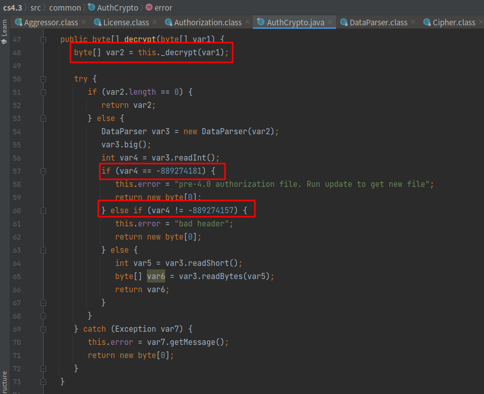

在`Authorization`类中得到的arrayOfByte2数组是去除前六位之后的内容，继续对arrayOfByte2数组进行处理，先获取四个数字赋值给i，再获取4个数字赋值给watermark，再获取一个数字赋值给b1，判断b1小于43，判断i是否等于29999999，在common/ListenerConfig中判断watermark为0时候会增加杀毒检测水印：


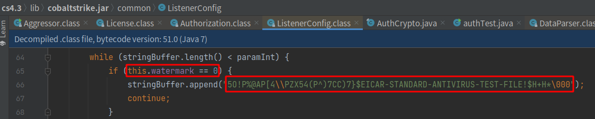

去除前6位后，再去除i、watermark、b1这9位，剩余的为4.0到4.3以来的key，为：16, 20, 20, 20, 20, 20, 20, 20, 20, 20, 20, 20, 20, 20, 20, 20, 20结构：

```
            byte b2 = dataParser.readByte();	//获取1位，即16
            byte[] arrayOfByte3 = dataParser.readBytes(b2);		//获取16位，为4.0的key
            byte b3 = dataParser.readByte();	//获取1位，即16
            byte[] arrayOfByte4 = dataParser.readBytes(b3);		//获取16位，为4.1的key
            byte b4 = dataParser.readByte();	//获取1位，即16
            byte[] arrayOfByte5 = dataParser.readBytes(b4);		//获取16位，为4.2的key
            byte b5 = dataParser.readByte();	//获取1位，即16
            byte[] arrayOfByte6 = dataParser.readBytes(b5);		//获取16位，为4.3的key赋值给arrayOfByte6
```

在Authorization类中调用SleevedResource.Setup方法对arrayOfByte6进行处理。在SleevedResource中把key设定为AES、HmacSHA256解密的秘钥，在_readResource中的this.data.decrypt(arrayOfByte1);进行解密调用，解密的内容为/sleeve/中的dll文件：

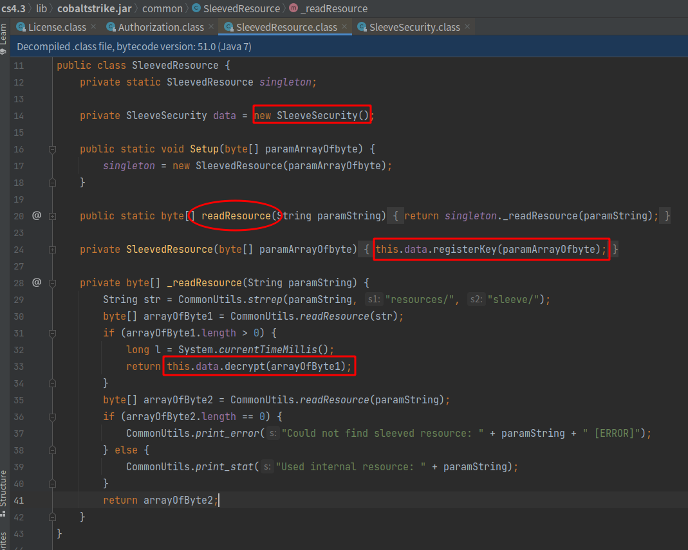

在SleeveSecurity中设定AES、HmacSHA256解密的秘钥，使用传入的值计算一个长度为256的摘要，再取0-16作为AES的密钥，取16-32作为HmacSHA256的密钥

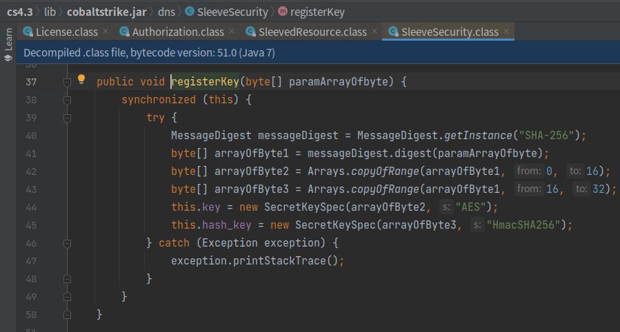

如果得不到对应的key，就无法对sleeve文件夹中的dll进行解密，连接服务端时候会提示[Sleeve] Bad HMAC的错误提示：


hmac解密部分可参考：[Cobaltstrike 4破解之 我自己给我自己颁发license](https://mp.weixin.qq.com/s/Pneu8R0zoG0ONyFXF9VLpg)

所以完成破解的关键是对应cs版本的key。

## 4.5版本新增校验

根据官方描述，4.5版本新增license的安全性，的确如此，

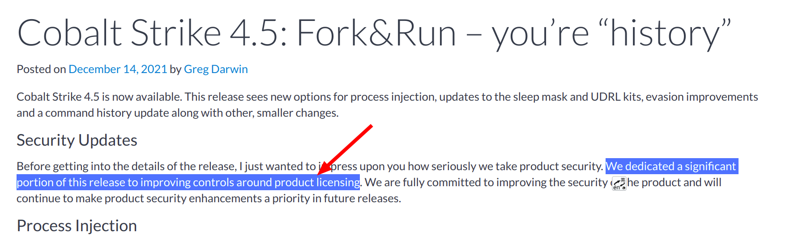

所以我们需要解密下泄漏的auth文件，看看多了什么：

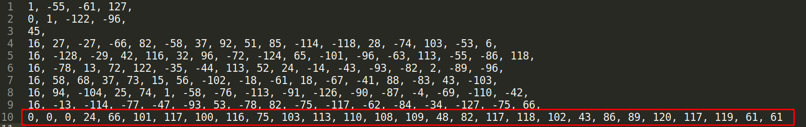

在4.5的key位置后面多了一串，多的这些是该版本新增的watermarkHash：

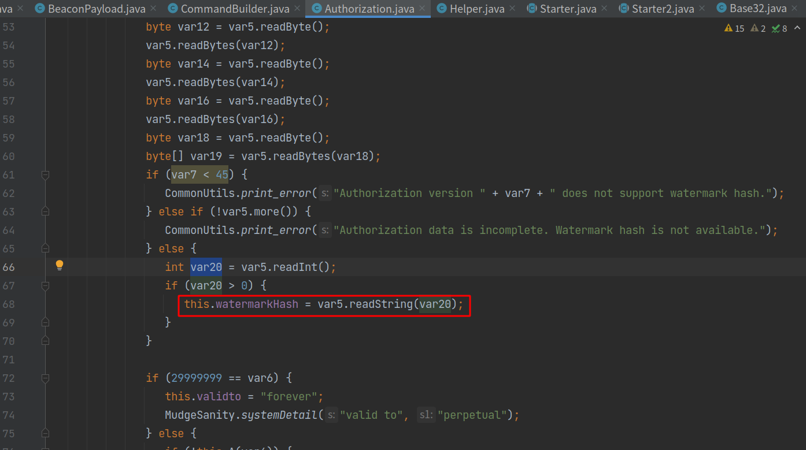

watermarkHash和beacon的生成有关，与sleeve文件夹中dll相关，没有他或者错误时无法上线。大概官方可以通过这个watermarkHash反溯到泄漏的源头吧。

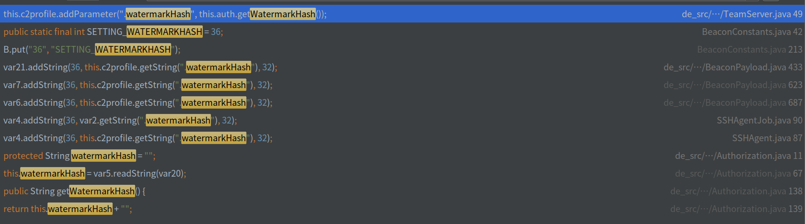


## 破解方式

### 方法一硬编码key

注释掉其他代码，对AuthCrypto().decrypt进行RSA解密后赋值的参数写死：

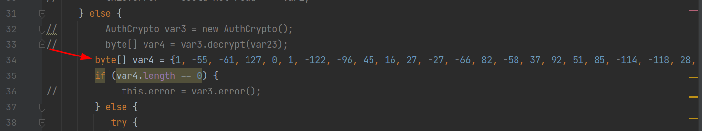

```
         byte[] var4 = {1, -55, -61, 127, 0, 1, -122, -96, 45, 16, 27, -27, -66, 82, -58, 37, 92, 51, 85, -114, -118, 28, -74, 103, -53, 6, 16, -128, -29, 42, 116, 32, 96, -72, -124, 65, -101, -96, -63, 113, -55, -86, 118, 16, -78, 13, 72, 122, -35, -44, 113, 52, 24, -14, -43, -93, -82, 2, -89, -96, 16, 58, 68, 37, 73, 15, 56, -102, -18, -61, 18, -67, -41, 88, -83, 43, -103, 16, 94, -104, 25, 74, 1, -58, -76, -113, -91, -126, -90, -87, -4, -69, -110, -42, 16, -13, -114, -77, -47, -93, 53, -78, 82, -75, -117, -62, -84, -34, -127, -75, 66, 0, 0, 0, 24, 66, 101, 117, 100, 116, 75, 103, 113, 110, 108, 109, 48, 82, 117, 118, 102, 43, 86, 89, 120, 117, 119, 61, 61};

```


### 方法二Javaagent方式

Javaagent原理：https://www.cnblogs.com/rickiyang/p/11368932.html

破解工具可参考：https://github.com/Twi1ight/CSAgent

破解的核心还是需要cs对应版本的key

## 去除暗桩

`beacon/BeaconData`中将`shouldPad`方法的值固定为false：

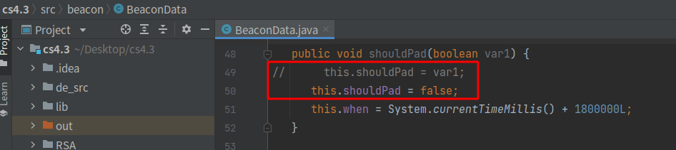

**4.4新暗桩**

（之前以4.3为例进行License认证分析，换成4.4后发现运行退出，存在新的暗桩）

相比之前的this.shouldPad的exit，又在common/Helper增加.class判断，注释即可：

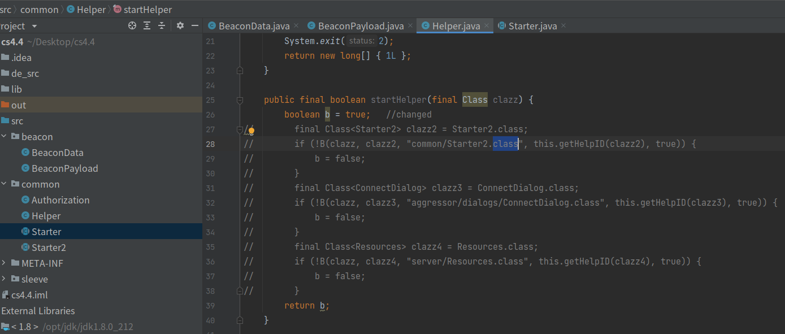

在common/Starter中增加.class判断，注释即可：

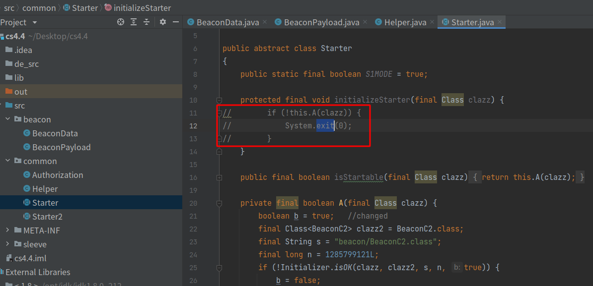

在common/Starter2中增加.class判断，注释即可：

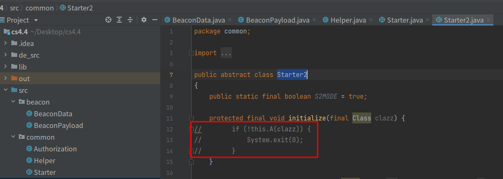

在beacon/CommandBuilder中增加.class判断：（这个暗桩还真狗，client和temserver连续连接4小时后无法执行命令，从没连接过这么久所以也没发现，ggg）

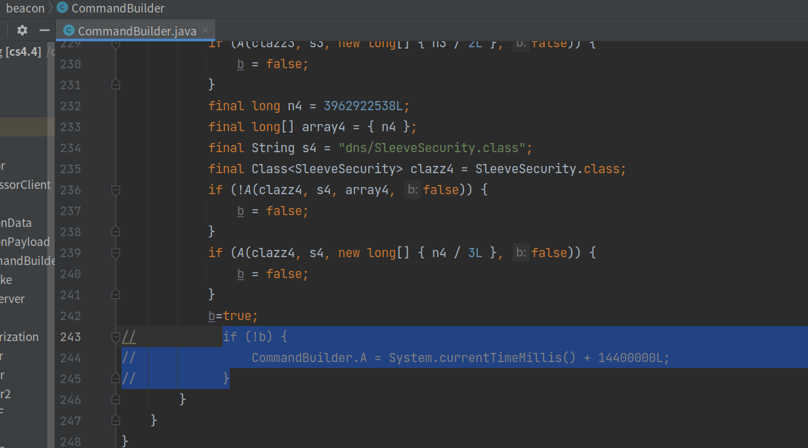

**4.5新暗桩**

4.5版本针对javaagent增加了一堆暗桩，反编译jar包进行破解的可以无视，具体搜索javaagent逐一修改即可：

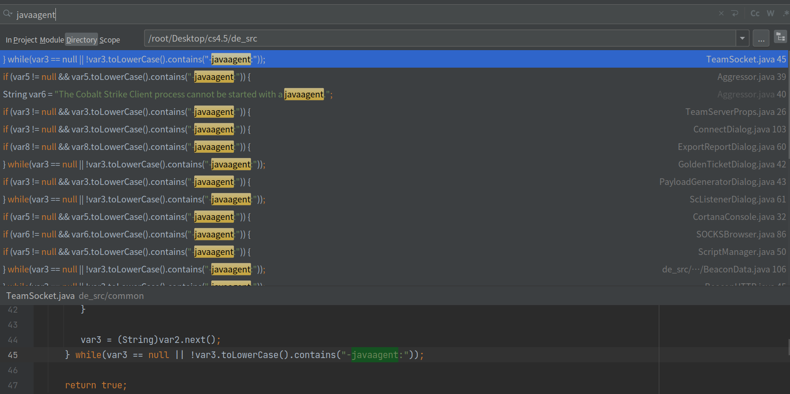

去掉这几处又可以团体运动了。


# cs去除checksum8特征

checksum8特征就不细说了，为了避免被nmap和空间搜索引擎扫描出来还是有必要改改的。

## 代码修改

`BeaconPayload`中修改异或数值为新：

随便一个10进制数字即可，后面dll中改成对应的16进制数字。

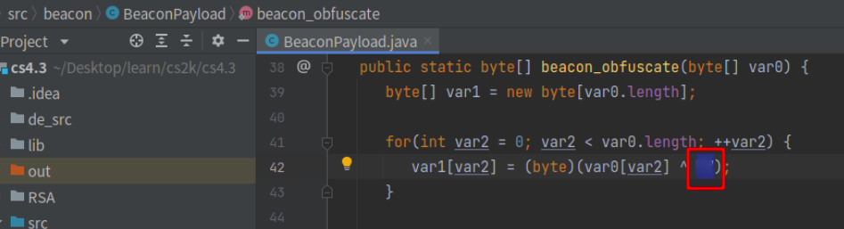

## dll修改

使用CrackSleeve把dll进行解密:https://github.com/ca3tie1/CrackSleeve/

1. 将cobaltstrike.jar和CrackSleeve.java放一起
2. 编译(`javac -encoding UTF-8 -classpath cobaltstrike.jar CrackSleeve.java`)
3. 解密文件(`java -classpath cobaltstrike.jar;./ CrackSleeve decode`)    # windows命令行执行

Alt+T进行关键字搜索：2Eh

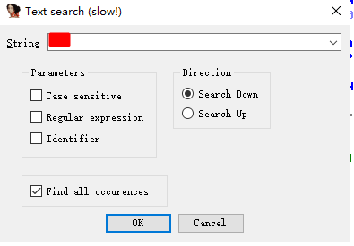


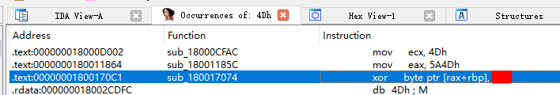


直接修改xor的值，先Change byte找到2E修改，再Apply pathes to input file保存。（别忘记保存）

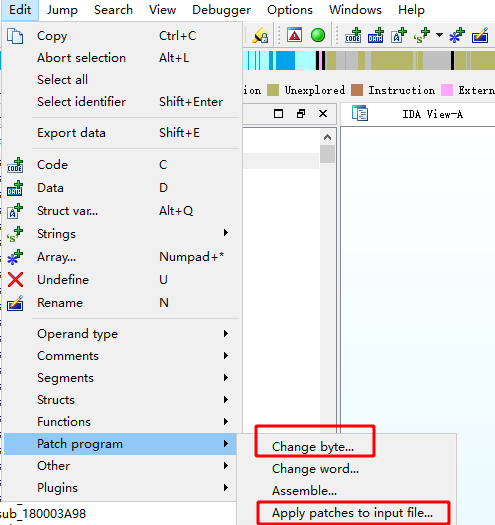

需要修改的dll：beacon.dll、beacon.x64.dll、dnsb.dll、dnsb.x64.dll、pivot.dll、pivot.x64.dll、extc2.dll、extc2.x64.dll（4.5新增几个rl100k.dll也需要修改）

再CrackSleeve加密dll，最后，把encode目录下的dll，放到idea项目目录中重新编译打包。

进行测试uri地址虽说仍旧可以请求到，但内容已经无法用nmap脚本解密出来，同理也可躲避空间搜索引擎的识别：

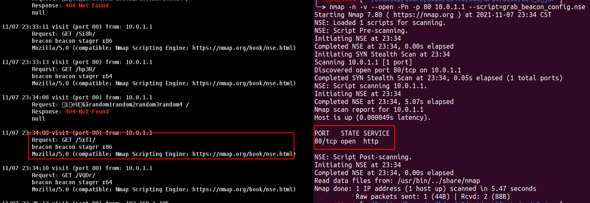


除了修改异或值的方式，也可以https://mp.weixin.qq.com/s?__biz=MzA3MDY2NjMxMA==&mid=2247484641&idx=1&sn=014f6c4ad5343e3f5034c33dffa66f26&chksm=9f3815c8a84f9cde1c7493ff29cfc89c0474fec48ede52be618727e7b9a5ab321c4743e1a44c&mpshare=1&scene=23&srcid=1202NA46yt71CvD3BMGKS10c&sharer_sharetime=1606892728447&sharer_shareid=ff83fe2fe7db7fcd8a1fcbc183d841c4#rd 改掉checksum8算法，但是只能固定uri访问了，需要配合profile才能使用，而且每次改uri还要重新打包，方法各有利弊吧。


# cs去除beaconeye特征


去beaconeye特征修改思路来源于[链接](https://www.t00ls.cc/articles-63215.html)，以4.3和4.4为例需要进行修改的字节如下。

使用CrackSleeve把dll进行解密:https://github.com/ca3tie1/CrackSleeve/

1. 将cobaltstrike.jar和CrackSleeve.java放一起

2. 编译(`javac -encoding UTF-8 -classpath cobaltstrike.jar CrackSleeve.java`)

3. 解密文件(`java -classpath cobaltstrike.jar;./ CrackSleeve decode`)    # windows命令行执行

4.3 key 58, 68, 37, 73, 15, 56, -102, -18, -61, 18, -67, -41, 88, -83, 43, -103
4.4 key 94, -104, 25, 74, 1, -58, -76, -113, -91, -126, -90, -87, -4, -69, -110, -42

## 4.3修改

### 32位dll

地址位：10009FBB

6A 00 修改为6A 09（00修改为任意）

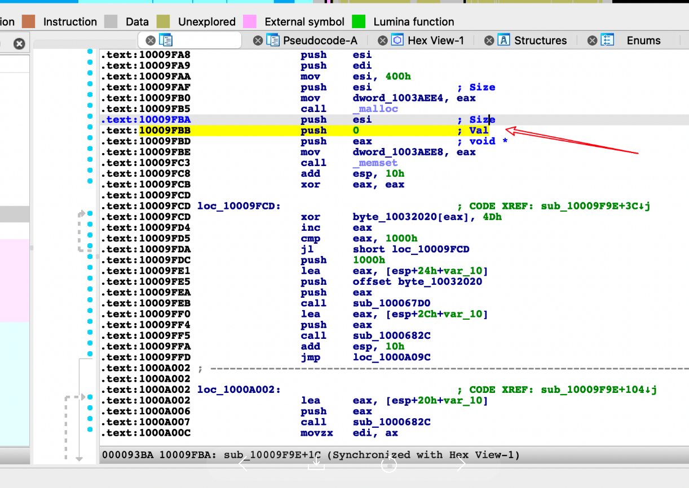


### 64位dll

地址位：000000001800186C3

beacon.x64.dll里面的指令是xor edx, edx，修改为mov edx, esi

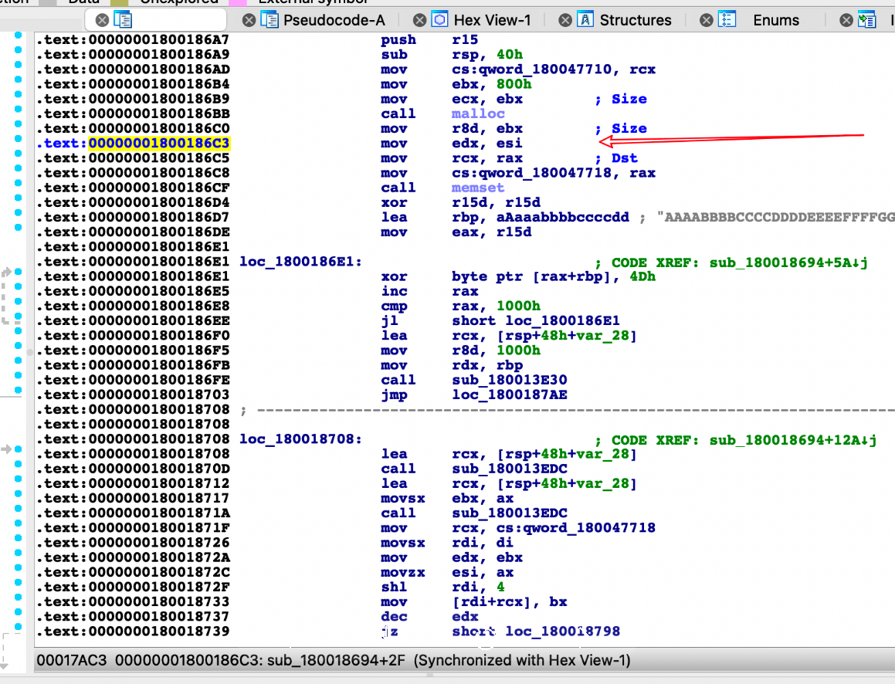

## 4.4修改

### 32位dll

地址位：1000A0B9

6A 00 修改为6A 09（00修改为任意）

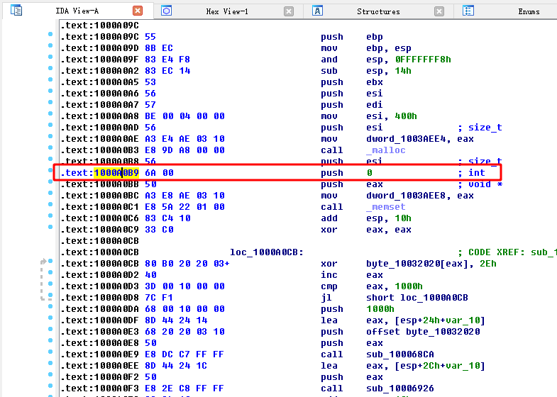


### 64位dll

地址位：000000018001879B

beacon.x64.dll里面的指令是xor edx, edx，修改为mov edx, esi

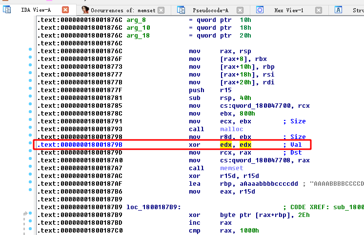


使用重新加密：`java -classpath cobaltstrike.jar;./ CrackSleeve encode`

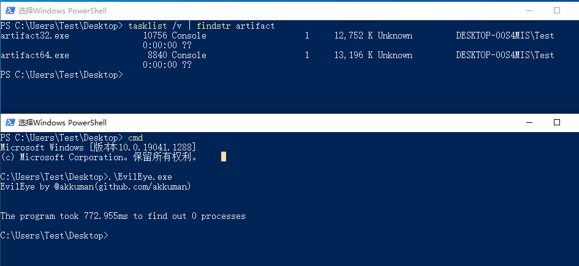

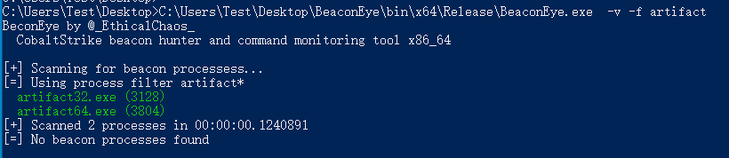

## 4.5修改

### 32位dll

地址位：1000A65D

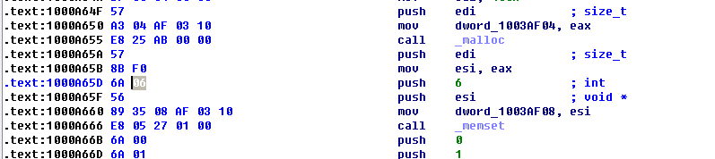


### 64位dll

地址位：000000018000CA3F

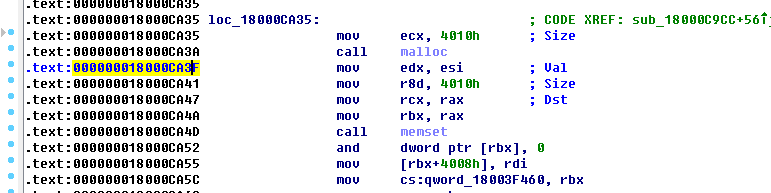

（4.5新增几个rl100k.dll也需要修改）


# cs修复错误路径泄漏stage

源头：https://mp.weixin.qq.com/s?__biz=Mzg2NjQ2NzU3Ng==&mid=2247489846&idx=1&sn=181c223cab4bce4e06def94604166348&chksm=ce4b32a1f93cbbb70e63e589d0da6323a8d2d4539c8aa0ef57d4005976dda6d73caeddebcac3&mpshare=1&scene=1&srcid=0308x6zXAxyDR8lv27V2O9yn&sharer_sharetime=1647358883801&sharer_shareid=15e69d4f532774f3e596a31efa4ef72b#rd

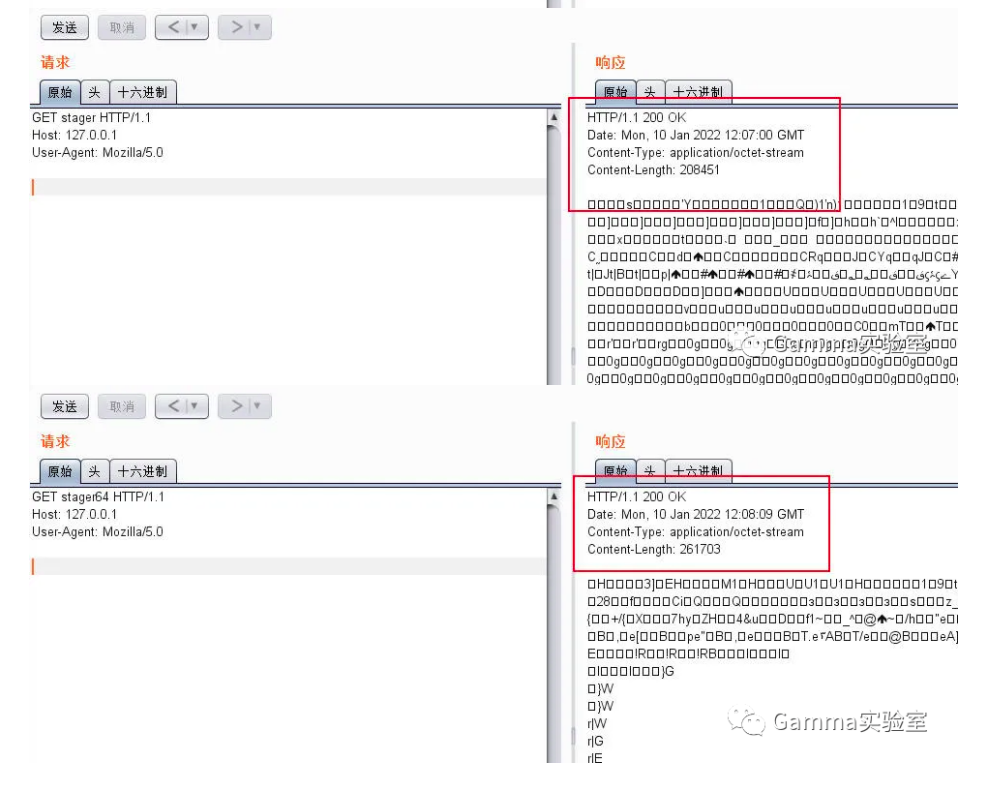

方法就是对uri加个/判断就可以了，不是/开头就响应到404：

4.4修改

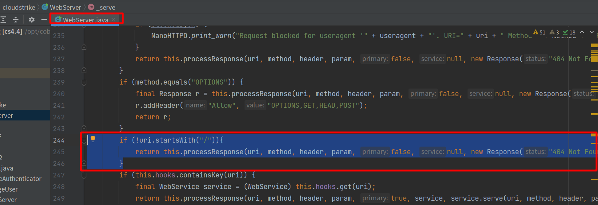

4.3修改

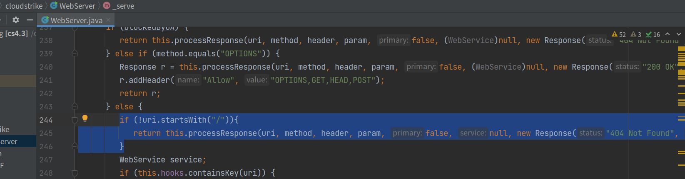

# 增加用户名加密显示

为了避免在Event Log中泄漏totp密码或者登录cs的名称，对name字段进行md5加盐显示，修改后如下：

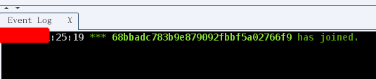

# 增加TOTP验证

增加了TOTP双因素验证，加强登录，防止爆破密码被掏。

teamserver端，teamserver输出中增加了个totp二维码链接：

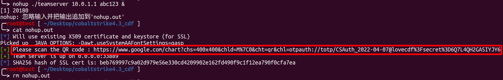

（删除nohup.out前记得复制出来QR code，每次启动teamserver会生成新的QR code所以每次启动teamserver都需要重新扫码）

浏览器打开（需翻墙）用谷歌Authenticator或者TOTP 验证器扫二维码，或者复制出secret%3D后的密钥，配置到验证器中也可：


connect端，host、port、password和以前依旧，user中，后六位为totp的动态数字即可连接：

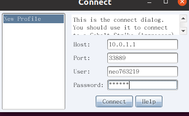

没有填写或填写错误totp动态数字会提示：

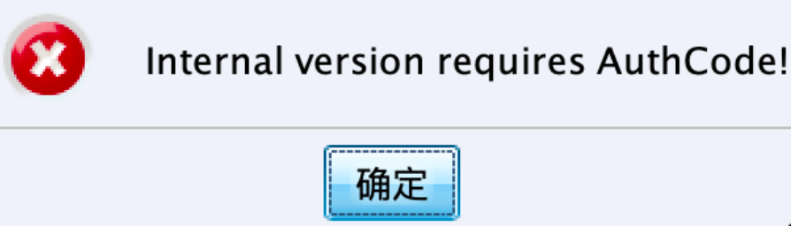

注：某些时候没手机，可以用浏览器的totp功能的插件或者python简单弄个totp代码即可。

# 修复cs4.5的foreign派生bug

使用windows/foreign/reverse_http(s)进行spawn时候报错如下：

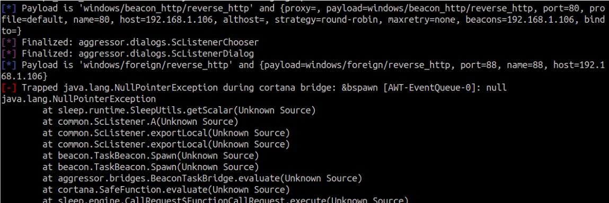

该版本在ScListener中增加了相关Custom的getScalar操作，但未考虑到foreign的情况，导致var1.customDLL、customFileName为空报错：

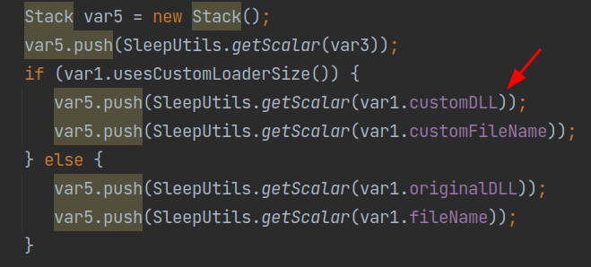

暂时的修复方式是通过判断payload为foreign时候，直接返回shellcode，该方法如有其他bug可提issues反馈：

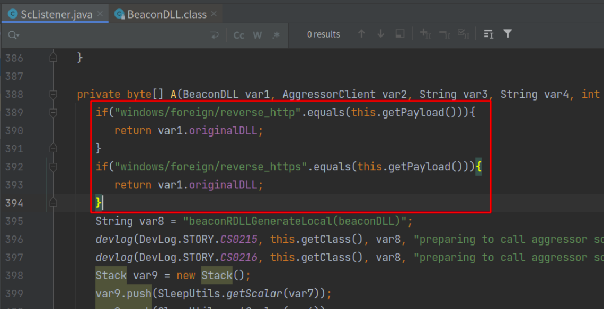

修复后可正常使用：

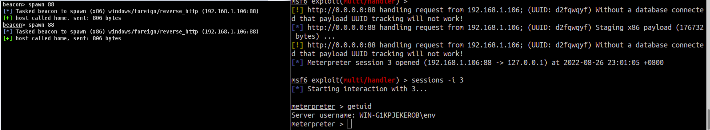


# cs客户端配置文件名字修改

为防止被mysql蜜罐读取配置，cs客户端配置文件名字不再默认，生成11位字符的文件名（mac地址md5后其中11位）。

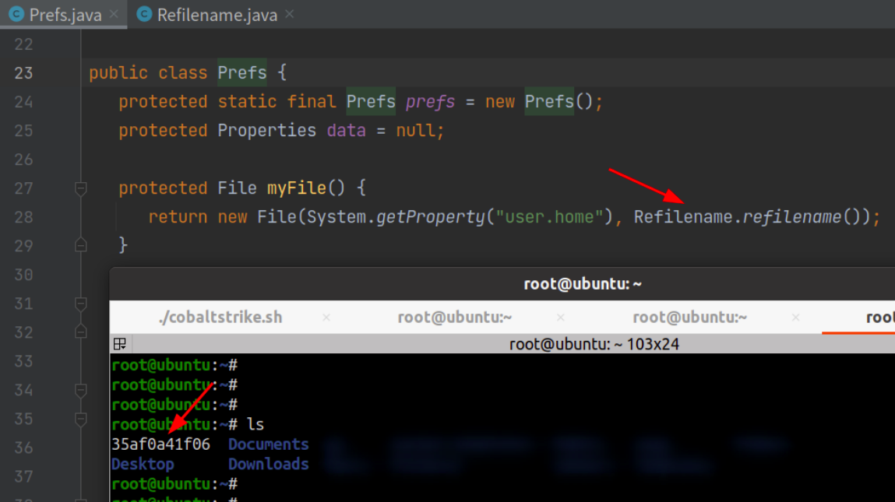

